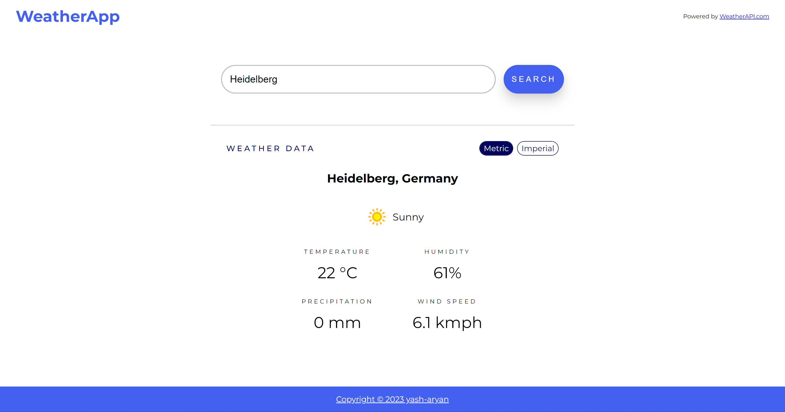

# Overview

This is a simple project where I make use of async/promises to fetch and display weather data from a third party API.

-   This is the GUI version of the web-app.
-   **Utilized Webpack** for bundling together all the files used to create this project.
-   **Utilized WeatherAPI** for fetching weather data for different locations.
-   The output `index.html` & `main.js` are stored in the `dist/` directory.
-   All of my files used to create `main.js` are stored in the `src/` directory.

# Project Status

-   [x] Create Basic Working GUI
-   [x] Update UI's Visual Design

<a href="https://yash-aryan.github.io/WeatherApp/" target="_blank"><h3>View Live Demo</h3></img></a>
